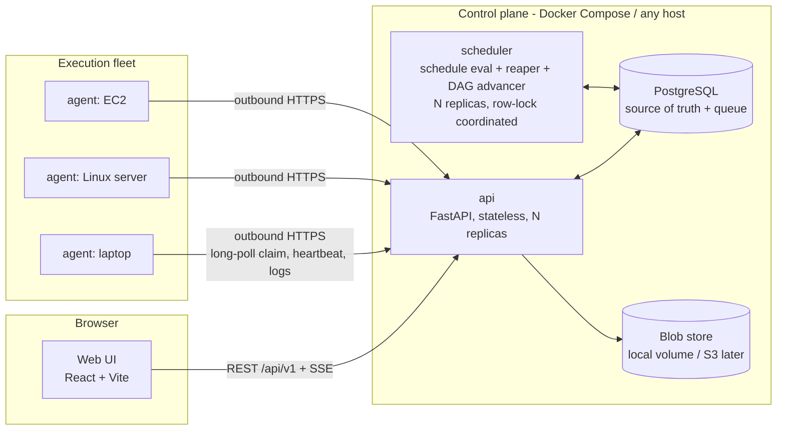
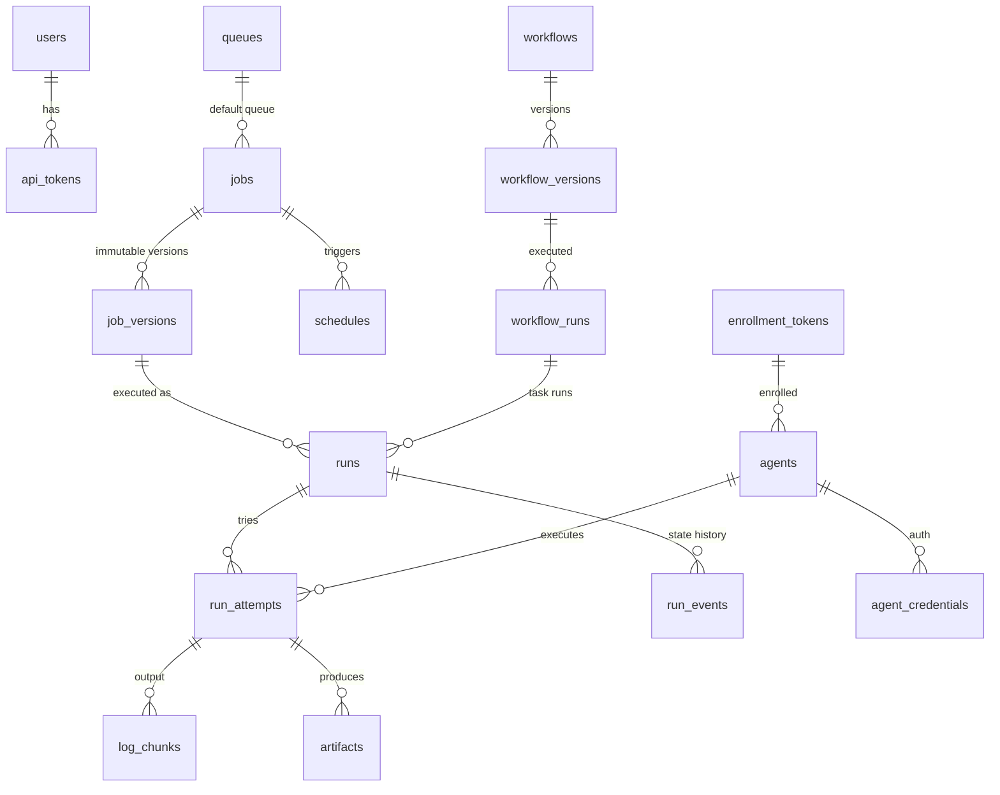
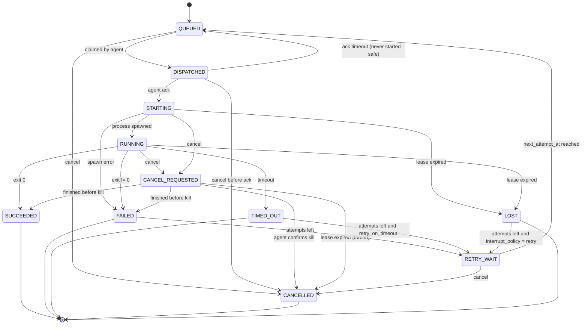

# Torqrun — Architecture Package (v0.1)

> Status: **approved** (2026-10-06). Naming history: proposed as *Cairn* (domain taken), then
> *Fleetherd* (M0–M1), renamed to **Torqrun** after M1 for a stronger identity. Implementation status is tracked
> in the root README; sections describe the target design, not what exists today.

---

## 1. Product definition and identity

**Name: Torqrun** — *torque* + *run*: the force that turns work into motion across your
machines. CLI `torq-agent`; Python packages `torqrun-*`; env prefix `TORQRUN_`.
Checked 2026-10-06: torqrun.com / .dev / .io had no RDAP registration, and the name was
unused on PyPI, npm and GitHub repository names. A formal trademark search is still
needed before a public 1.0 release.

**One-line definition.** Torqrun is a self-hostable job and workflow orchestrator that runs
scripts on your own machines — laptop, Linux servers, EC2 — through lightweight
outbound-only agents, with a durable PostgreSQL-backed control plane and a dashboard that
shows exactly what ran, where, and why it failed.

**Who it is for.** Small-to-medium engineering teams and individual developers who today
use cron + SSH + log files, and find Airflow/Dagster too heavy or too data-pipeline-centric
for "run this script on that box, reliably, and tell me what happened".

**Positioning (what makes it different).**

| Pillar | Meaning |
|---|---|
| Machines first | The agent fleet is a first-class concept (inventory, health, capacity, draining), not an executor plug-in. |
| Scripts first | A job is any Python/shell entrypoint. No SDK required to run something; SDK is optional for workflows. |
| Honest reliability | At-least-once dispatch with fencing; explicit, documented rules for when an interrupted run is retried. Never claims exactly-once. |
| One database | PostgreSQL is the source of truth *and* the queue. Redis is optional. Runs on one laptop via Docker Compose. |

**CLI name:** `torqrun` (`torqrun agent register`, `torqrun agent start`, …). Python package: `torqrun`.

---

## 2. Capability comparison

Comparison is at the level of publicly documented concepts; we implement our own versions.

| Capability | Airflow | Dagster | Prefect | Rundeck | Temporal | **Torqrun (ours)** |
|---|---|---|---|---|---|---|
| Primary unit | DAG of tasks | Software-defined assets / ops | Flows/tasks | Ops job on nodes | Durable workflow code | **Job (script) + DAG workflow** |
| Definition style | Python files parsed by scheduler | Python code locations | Python decorators | UI / YAML | Code (SDK) | **API/UI/YAML for jobs; YAML workflows first, Python SDK later** |
| Remote execution model | Executors (Celery/K8s); remote edge workers via provider | Run launchers; hybrid agent in hosted product | Workers poll work pools (pull) | SSH push; runners in some editions | Workers poll task queues (pull) | **Outbound HTTPS pull agents** |
| Machine inventory / health UI | Minimal | Minimal | Worker status | Strong (nodes) | Worker pollers | **Strong: agents, capacity, drain, revoke** |
| Script-without-SDK | Via Bash/Python operators | Needs op wrapper | Needs flow wrapper | Yes | No | **Yes (core use case)** |
| Durable scheduling | Yes | Yes | Yes | Yes (Quartz) | Schedules | **Yes, Postgres-backed, replica-safe** |
| Retries/backoff | Yes | Yes | Yes | Yes | Yes | **Yes, with jitter, per job & task** |
| Exactly-once claims | No | No | No | No | Durable workflow state, activities at-least-once | **No — at-least-once + fencing + idempotency declaration** |
| Extra infra needed | Metadata DB + broker (Celery) | DB + daemon | DB/server | DB | Cassandra/Postgres + server cluster | **PostgreSQL only** |

**What we implement ourselves (core value):** agent protocol & fleet management, Postgres
dispatch queue with leases/fencing, run state machine, durable scheduler, log pipeline,
DAG engine, dashboard. **What we deliberately reuse:** `croniter` (cron parsing),
`zoneinfo` (tz/DST), SQLAlchemy/Alembic, FastAPI, React Flow (`@xyflow/react`, MIT) for
graph rendering, OpenTelemetry SDK, `prometheus-client`. **What we skip for now:** asset
lineage, data-aware scheduling, dynamic task mapping, Kubernetes executor.

---

## 3. MVP scope

MVP = what a 1–3 person team can ship and **actually test** in roughly 10–14 weeks of
focused work (estimate, not a commitment).

**In MVP**
- Docker Compose deployment: `postgres`, `api`, `scheduler`, `web`, optional `agent`.
- Jobs: Python and shell; immutable versions; parameters; env vars; secret *references*; timeout; retry policy; queue; priority; tags; required capabilities; concurrency limit.
- Runs: manual trigger, schedule trigger, API trigger with idempotency key; full state machine; retry; cancel; rerun; lost-run detection.
- Agents: enrollment tokens, revocable credentials, heartbeats, capacity, tags, drain, revoke; Linux (Ubuntu/Debian/RHEL family) and macOS for dev.
- Logs: live streaming (SSE), stdout/stderr separated, sequence-ordered, size-capped, secret redaction, download.
- Scheduler: cron + interval, time zones/DST, misfire policy, pause/resume, replica-safe.
- Workflows: YAML DAGs, dependencies, parallelism, per-task retry, failure propagation, rerun-failed, graph view.
- Auth: local users (password + Argon2), API tokens, three fixed roles (admin / operator / viewer).
- Observability: structured JSON logs, `/healthz` `/readyz`, Prometheus `/metrics`, audit log.
- UI pages: Overview, Jobs, Job detail, Create/edit job, Runs, Run detail + log viewer, Workflows, Workflow run graph, Schedules, Agents, Queues, Audit log, Users, Settings.

**After MVP** — Windows agent, container execution backend, S3 artifacts (local disk in MVP), notifications (Slack/email/webhook/Teams), Python SDK, OIDC SSO, custom roles, multi-workspace tenancy, visual workflow *editor* (MVP has a viewer + YAML editor), metrics pages beyond basics, Helm chart.

---

## 4. System architecture

### 4.1 Component diagram



### 4.2 Layer responsibilities (the hard boundaries)

| Layer | Owns | Never does |
|---|---|---|
| **Control plane – `api`** | AuthN/Z, CRUD, run creation, agent protocol endpoints, dispatch (claim) transaction, log ingest, SSE fan-out. Stateless; any replica serves any request. | Never executes user code. Never holds authoritative state in memory. |
| **Control plane – `scheduler`** | Evaluating due schedules → creating runs; reaping expired leases (→ `LOST`); moving `RETRY_WAIT` → `QUEUED`; advancing workflow DAGs; log offload & retention. Each loop is a short Postgres transaction using `FOR UPDATE SKIP LOCKED`, so N replicas are safe. | Never talks to agents directly. |
| **Orchestration core** (`packages/torqrun-core`, a library) | Pure domain logic: state machine, retry/backoff math, cron/misfire math, DAG validation and readiness, dispatch eligibility rules. No I/O. | No FastAPI, no DB sessions, no HTTP. Heavily unit-tested. |
| **Agent** | Enrollment, identity storage, heartbeat, claiming work, acking before start, managing local slots. | Never accepts inbound connections. Never runs a job it didn't successfully ack. |
| **Execution runtime** (inside the agent, pluggable `Executor` interface) | Workspace prep, subprocess spawn (argv, no shell interpolation), env construction, rlimits, timeout, signal escalation, stdout/stderr capture. MVP: `local-process`. Later: `docker`. | Not a security sandbox (see §9). |
| **Persistence** | PostgreSQL: definitions, versions, runs, attempts, events, log chunks, audit, idempotency keys. Blob store: offloaded logs, artifacts. | Redis is not used in MVP. |

**Why no message broker:** dispatch is a `SELECT … FOR UPDATE SKIP LOCKED` on `run_attempts`
inside the same transaction that changes state, so "state changed" and "work enqueued" can
never diverge (no outbox needed for dispatch). Wakeups use `LISTEN/NOTIFY` as a *hint*
only; correctness never depends on a notification being delivered. Postgres comfortably
handles this pattern at the scale of thousands of runs/hour; we will benchmark before
claiming numbers. A transactional `outbox` table is used only for *external* side effects
(notifications, webhooks) later.

---

## 5. Agent protocol

### 5.1 Transport

- HTTPS, JSON, agent → control plane only. Base path `/api/v1/agent/*`.
- **Long-poll claim** (agent waits up to 25 s for work) rather than WebSockets in MVP:
  works through proxies/load balancers, keeps API replicas stateless, trivially retryable.
  Cancellation and drain signals ride on heartbeat responses (≤ 10 s latency). **[DECISION D4]**
- Every agent request carries `Authorization: Bearer <access_token>` and `X-Torqrun-Agent-Version`.
- All mutating agent calls are idempotent (keyed by `attempt_id` + `lease_token` + sequence).

### 5.2 Identity and enrollment

```mermaid
sequenceDiagram
  participant Admin
  participant API
  participant Agent
  Admin->>API: POST /api/v1/enrollment-tokens {ttl: 1h, max_uses: 1, tags, pool}
  API-->>Admin: "cet_…" (shown once; stored as SHA-256 hash)
  Admin->>Agent: torqrun agent register --url https://cp --token cet_…
  Agent->>API: POST /agent/enroll {token, name, hostname, os, arch, version, capabilities, max_slots}
  API->>API: verify hash, not expired, uses < max_uses (row lock), increment uses
  API-->>Agent: {agent_id, refresh_credential "car_…"} (shown once; stored hashed)
  Agent->>Agent: write ~/.config/torqrun/agent.json (mode 0600) or /etc/torqrun/agent.json
  loop every ~10 min
    Agent->>API: POST /agent/token {agent_id, refresh_credential}
    API-->>Agent: {access_token (JWT, 15 min, aud=agent, sub=agent_id, cred_id)}
  end
```

- Enrollment tokens: random 32 bytes, hashed at rest, TTL default 1 h, `max_uses` default 1, revocable.
- Refresh credential: random 32 bytes, hashed (SHA-256; it's high-entropy so a slow hash isn't needed). Rotation: `POST /agent/credentials/rotate` returns a new one; old valid for a 5 min overlap. Revoking the agent invalidates all credentials; the next token refresh fails within ≤ 15 min, and **heartbeat checks agent status on every call**, so revocation actually takes effect on the next heartbeat (≤ 10 s).
- No shared secret is ever embedded in the agent package.
- Replay: TLS + short-lived tokens; mutating calls are idempotent; completion reports are fenced by `lease_token`, so a replayed old report can't change a newer attempt. Request signing (Ed25519) is a post-MVP option. **[DECISION D5]**

### 5.3 Heartbeat, claim, execute, report

```mermaid
sequenceDiagram
  participant Ag as Agent
  participant API
  participant DB as PostgreSQL
  loop every 10s
    Ag->>API: POST /agent/heartbeat {running:[{attempt_id, lease_token}], free_slots, load}
    API->>DB: update agents.last_seen; extend leases of listed attempts (lease_expires_at = now+60s)
    API-->>Ag: {cancel:[attempt_ids], drain:bool, revoked:bool, server_time}
  end
  Ag->>API: POST /agent/claim {free_slots: 2, wait: 25}
  API->>DB: BEGIN; SELECT eligible QUEUED attempts ORDER BY priority, queued_at FOR UPDATE SKIP LOCKED LIMIT n<br/>(respecting queue + job concurrency); set DISPATCHED, agent_id, lease_token, lease_expires_at; COMMIT
  API-->>Ag: {assignments:[{attempt_id, lease_token, spec}]}
  Ag->>API: POST /agent/attempts/{id}/ack {lease_token}
  API->>DB: DISPATCHED → STARTING (only if lease_token matches)
  Note over Ag: Agent spawns process ONLY after ack succeeds
  Ag->>API: POST /agent/attempts/{id}/started {pid, started_at}
  API->>DB: STARTING → RUNNING
  loop while running (batched ≤ 1s or 64 KiB)
    Ag->>API: POST /agent/attempts/{id}/logs {lease_token, chunks:[{seq, stream, ts, data}]}
    API->>DB: INSERT … ON CONFLICT (attempt_id, seq) DO NOTHING; NOTIFY
  end
  Ag->>API: POST /agent/attempts/{id}/complete {lease_token, outcome, exit_code, finished_at, last_seq, usage, error_summary}
  API->>DB: RUNNING → SUCCEEDED / FAILED / TIMED_OUT / CANCELLED; schedule retry if policy allows
```

Key rules:

1. **Ack-before-spawn.** A `DISPATCHED` attempt not acked within 30 s is returned to
   `QUEUED` by the reaper. This is *safe* because the agent never starts a process without
   a successful ack — so an un-acked attempt is guaranteed not to have run.
2. **Fencing.** Every attempt gets a fresh `lease_token`. Once an attempt is marked `LOST`,
   its token is dead: late `logs`/`complete` calls get `409 lease_revoked` and the agent
   kills the process if still running.
3. **Agent offline buffering.** If the API is unreachable, the agent keeps running jobs,
   spools logs and the final result to a local SQLite/JSONL spool, and replays on
   reconnect. If the lease has expired meanwhile, the server keeps the result as
   `late_result` on the attempt record (for visibility) but does not change state.
4. **Eligibility for claim:** agent `ONLINE`/`BUSY` (not `DRAINING`/`REVOKED`), agent's
   pool/queues include the run's queue, `job.required_capabilities ⊆ agent.capabilities`,
   `job.target_tags ⊆ agent.tags`, OS matches, and both queue and job concurrency limits
   have headroom (counted from active attempts in the same transaction, using per-queue
   row locks to avoid races).
5. **Version compatibility:** API responds `426` with `min_agent_version` if the agent is
   too old; agent logs a clear error and stays offline rather than misbehaving.

### 5.4 Execution runtime (local-process backend)

- Workspace: `<agent_data>/work/<run_id>/<attempt_no>/`; script written from the job
  version's spec; removed after completion unless `keep_workspace=true`.
- Command: Python → `[python_path, script.py, *args]`; shell → `["/bin/bash", "script.sh", *args]`.
  `subprocess` with argv list, `shell=False`, new session/process group.
- Environment: **allowlist** (`PATH`, `HOME`, `LANG`, `TZ`) + job env + resolved secrets
  + `TORQRUN_RUN_ID`, `TORQRUN_ATTEMPT`. Agent's own credentials are never in the child env.
- Limits (Linux): `RLIMIT_CPU`, `RLIMIT_AS`, `RLIMIT_NOFILE`, `RLIMIT_NPROC` via
  `preexec_fn`/`resource`; wall-clock timeout enforced by the agent.
- Cancel/timeout: `SIGTERM` to process group → grace period (default 10 s) → `SIGKILL`.
- Output: separate pipes, each line/chunk timestamped at read time, single monotonic `seq`
  across both streams; per-attempt output cap (default 50 MiB) → truncate with marker.
  Backpressure: bounded in-memory buffer; when full the agent spools to disk, never blocks the child indefinitely.
- Redaction: secret values (and their base64 form) are replaced with `***` in the agent
  before any byte leaves the machine.

---

## 6. PostgreSQL schema (initial)

Conventions: UUIDv7 primary keys (time-ordered, good index locality), `timestamptz`
everywhere, `created_at`/`updated_at`, enums as `text` + `CHECK` (easier migrations than PG enums).
A `workspace_id` column is **not** in MVP — single-tenant. **[DECISION D7]**



Key tables (abridged; full DDL comes with the Alembic migration in M0/M1):

```sql
-- definitions
jobs(id, name UNIQUE, description, current_version_id, default_queue_id, paused bool, archived_at, created_by, created_at, updated_at)
job_versions(id, job_id, version int, spec jsonb NOT NULL,         -- runtime, entrypoint/script, args, env, secret_refs,
             spec_hash text, created_by, created_at,              -- timeout, retry, priority, tags, capabilities,
             UNIQUE(job_id, version))                             -- concurrency, interrupt_policy, limits
queues(id, name UNIQUE, max_concurrency int NULL, paused bool, created_at)
schedules(id, job_id NULL, workflow_id NULL, kind ('cron'|'interval'), expr text, timezone text,
          misfire_policy ('skip'|'run_once'|'run_all'), misfire_grace interval, max_catchup int,
          enabled bool, next_fire_at timestamptz, last_fired_at timestamptz, params jsonb, created_at, updated_at)
  INDEX (next_fire_at) WHERE enabled

-- execution
runs(id, job_id, job_version_id, workflow_run_id NULL, task_key NULL,
     trigger ('manual'|'schedule'|'api'|'retry'|'rerun'|'workflow'), triggered_by,
     schedule_id NULL, scheduled_for NULL, rerun_of NULL,
     status, priority, queue_id, params jsonb, spec_snapshot jsonb,     -- resolved spec actually executed
     current_attempt int, max_attempts int, next_attempt_at NULL,
     queued_at, started_at, finished_at, error_summary, created_at, updated_at,
     UNIQUE(schedule_id, scheduled_for))                              -- schedule de-dup
  INDEX (status, queue_id, priority, queued_at)
run_attempts(id, run_id, attempt_no, status, agent_id NULL, lease_token NULL, lease_expires_at NULL,
             dispatched_at, acked_at, started_at, finished_at, exit_code, outcome_reason,
             pid, usage jsonb, late_result jsonb NULL, log_bytes bigint, log_location text NULL,
             UNIQUE(run_id, attempt_no))
  INDEX (status, lease_expires_at) WHERE status IN ('DISPATCHED','STARTING','RUNNING')
run_events(id bigserial, run_id, attempt_no, from_status, to_status, reason, actor, at, data jsonb)
log_chunks(attempt_id, seq bigint, stream ('stdout'|'stderr'|'system'), ts, data text,
           PRIMARY KEY(attempt_id, seq))                              -- offloaded to blob + deleted after finish
artifacts(id, attempt_id, name, size, sha256, content_type, location, created_at, expires_at)

-- fleet
agents(id, name UNIQUE, hostname, os, arch, agent_version, capabilities text[], tags text[],
       queues text[], max_slots int, used_slots int, status, last_seen_at, enrolled_via, created_at, revoked_at)
agent_credentials(id, agent_id, secret_hash, created_at, expires_at NULL, revoked_at NULL)
enrollment_tokens(id, token_hash UNIQUE, description, tags text[], queues text[], max_uses, uses, expires_at, revoked_at, created_by)

-- workflows
workflows(id, name UNIQUE, current_version_id, created_at, updated_at)
workflow_versions(id, workflow_id, version, definition jsonb, created_at, UNIQUE(workflow_id, version))
workflow_runs(id, workflow_id, workflow_version_id, status, trigger, params jsonb, rerun_of NULL, created_at, started_at, finished_at)

-- platform
users(id, email UNIQUE, password_hash, role ('admin'|'operator'|'viewer'), disabled, created_at)
api_tokens(id, user_id, name, token_hash UNIQUE, last_used_at, expires_at, revoked_at)
secrets(id, name UNIQUE, ciphertext bytea, key_id, created_at, updated_at)   -- AES-GCM, key from env/KMS
idempotency_keys(key, scope, request_hash, response jsonb, created_at, PRIMARY KEY(scope, key))  -- 24h TTL
audit_events(id bigserial, actor_type, actor_id, action, target_type, target_id, at, ip, data jsonb)
outbox(id bigserial, topic, payload jsonb, created_at, processed_at NULL)   -- notifications (post-MVP)
```

**Run vs. version:** a run references `job_version_id` *and* stores `spec_snapshot` (the
fully resolved spec, secrets as references only). Editing a job creates a new version; old
runs stay exactly understandable.

---

## 7. Run state machine and recovery

### 7.1 Definitions

- **Run** — one logical request to execute a job version (one trigger = one run).
- **Attempt** — one physical execution of a run on one agent. Retries add attempts to the *same* run.
- **Retry** — automatic or manual new attempt within the same run (same params, same version).
- **Rerun** — a *new* run with `rerun_of` set; may use the job's *current* version (default) or the original (`?version=original`).
- **Workflow rerun** — new workflow run; `rerun_failed` mode copies succeeded task results and only re-executes failed/downstream tasks (only if the workflow version is unchanged).

### 7.2 States



- Terminal: `SUCCEEDED`, `FAILED`, `TIMED_OUT`, `CANCELLED`, `LOST` (when no retry follows).
- The transition table lives in `torqrun-core` as data; every DB update is
  `UPDATE … SET status=:to WHERE id=:id AND status=:from` (compare-and-set) plus a
  `run_events` insert in the same transaction. Invalid transitions raise and are rejected with `409`.
- Run status mirrors its current attempt, except `RETRY_WAIT`, which is run-only.

### 7.3 Retries

`retry: {max_attempts: 3, backoff: exponential, initial: 10s, factor: 2, max: 10m, jitter: full, retry_on_timeout: false}`
→ delay = `random(0, min(max, initial * factor^(n-1)))` ("full jitter").

### 7.4 Interrupted runs — when is it safe to retry?

| Situation | What we know | Default action |
|---|---|---|
| Dispatched, never acked | Process never started (ack-before-spawn) | Requeue automatically, same attempt number |
| Agent crashed / host lost mid-run (lease expired) | Process may have partially run and caused side effects | `LOST`. Retry **only** if job declares `interrupt_policy: retry` (i.e. the user asserts it's idempotent). Default `fail`. |
| Agent restarts while child still alive | Agent finds its state file with live PIDs | Re-attaches if PID+start-time match and resumes heartbeats; otherwise reports `LOST` itself |
| Control plane down, agent fine | Agent keeps running, spools results | On reconnect, results applied if lease still valid; otherwise stored as `late_result` |
| Network partition > lease TTL | Server marks `LOST`; agent learns via `409` | Agent kills child; no double-running unless policy says retry |

We guarantee **at-most-one active attempt per run** (fencing), and **at-least-once**
execution *only* for jobs opting into `interrupt_policy: retry`. We do not claim exactly-once.

### 7.5 Duplicate prevention

- Schedules: `UNIQUE(schedule_id, scheduled_for)` + `INSERT … ON CONFLICT DO NOTHING`; the schedule row's `next_fire_at` is advanced in the same transaction.
- API: `Idempotency-Key` header on `POST /runs`, `/workflows/{id}/runs`, `/runs/{id}/retry`, `/runs/{id}/rerun`; stored 24 h with request hash (different body + same key → `422`).
- Concurrency policy per job: `allow` | `forbid` (skip if one active) | `queue` (default) | `replace` (cancel previous).

### 7.6 Scheduler semantics

- Loop every 1 s: `SELECT … FROM schedules WHERE enabled AND next_fire_at <= now() FOR UPDATE SKIP LOCKED LIMIT 100`.
- Cron evaluated in the schedule's IANA timezone (`zoneinfo`). DST: a local time that doesn't exist (spring forward) fires at the next valid instant; a repeated local time (fall back) fires **once**, at the first occurrence. Documented and unit-tested.
- Misfire (scheduler down): `skip` → advance to next future slot; `run_once` → one run for the latest missed slot; `run_all` → one run per missed slot, capped by `max_catchup`.
- Pause = `enabled=false`; resume recomputes `next_fire_at` from `now()` (no burst).

---

## 8. Workflows

**Format [DECISION D8]:** YAML/JSON declarative definitions first; Python SDK that *emits*
the same JSON later.

| | Declarative YAML | Python SDK (code is the definition) |
|---|---|---|
| Editable from UI | Yes | No (needs code deploy) |
| Validatable server-side, safe to store | Yes | Requires executing user code in the control plane — we refuse that |
| Expressiveness | Limited (no loops) | High |
| Versioning | Trivial (stored JSON) | Requires code packaging |

```yaml
apiVersion: torqrun/v1
kind: Workflow
name: nightly-etl
params: {date: "{{ scheduled_for | date }}"}
tasks:
  extract:   {job: extract-orders, params: {date: "{{ params.date }}"}}
  transform: {job: transform-orders, depends_on: [extract]}
  report:    {job: send-report, depends_on: [transform], trigger_rule: all_success}
  cleanup:   {job: cleanup-tmp, depends_on: [transform], trigger_rule: all_done}
```

Engine: when a task run finishes, the scheduler's "advancer" loop locks the workflow run,
evaluates readiness in `torqrun-core` (pure function: graph + task states → tasks to start /
skip), and creates task runs in one transaction. Validation: cycle detection (Kahn's
algorithm), unknown job references, unknown dependency keys, max 500 tasks.

---

## 9. Security threat model

**Assets:** control-plane DB (secrets, credentials), agent hosts, agent credentials, job output, user accounts.
**Trust boundaries:** browser ↔ API; agent ↔ API; agent process ↔ job process; job process ↔ host.

| # | Threat | Mitigation (MVP) | Residual risk |
|---|---|---|---|
| T1 | Stolen enrollment token | Short TTL, single use, hashed, revocable, audited; agent shows in UI as new | Window of TTL |
| T2 | Stolen agent credential | Hashed at rest, revocable, rotation, 15 min access tokens, per-agent scoping (agent can only touch its own attempts) | Attacker can claim jobs matching that agent until revoked → may receive secrets of those jobs |
| T3 | Malicious job reads agent credential | Credential file `0600` owned by agent user; child gets allowlisted env only; **recommend running jobs as a separate OS user** (agent option `run_as`) | Same-user execution (default on dev laptops) *can* read the file. **Subprocess execution is not a sandbox.** |
| T4 | Malicious job attacks host | rlimits, timeouts, dedicated low-privilege user; container backend (post-MVP) with no privileged mode, no Docker socket, no host mounts by default, read-only rootfs, dropped caps, seccomp default | Kernel exploits, container escapes; mounting `/var/run/docker.sock` = root on host (documented, refused by default) |
| T5 | Secret leakage via logs/API | Secret refs only in job specs; decrypted only into the child env at dispatch; redaction in agent; API never returns secret values or credential hashes | Programs can transform secrets (e.g. reversed) to evade redaction |
| T6 | Rogue/compromised control plane | Agents only run what the CP sends — the CP is fully trusted by design. Optional agent-side allowlist (`allowed_runtimes`, `allowed_dirs`) | Compromised CP = code execution on all agents. Protect it accordingly. |
| T7 | MITM between agent and CP | HTTPS required (agent refuses `http://` except `localhost` dev mode); optional CA pinning | Misconfigured TLS |
| T8 | Command injection | argv lists, `shell=False`; params passed as args/env, never string-interpolated into shell | User's own shell script may be unsafe internally |
| T9 | Replay of agent requests | TLS, short tokens, idempotent endpoints, lease-token fencing | — |
| T10 | Web attacks (XSS/CSRF) | Logs rendered as text (never HTML), strict CSP, SameSite=strict session cookie + CSRF token, API tokens via header | — |
| T11 | Brute force / abuse | Argon2id passwords, login rate limit, API rate limit per token | — |
| T12 | Privilege escalation in UI | RBAC checked server-side on every endpoint; audit events for every mutation | — |

Platform never opens ports, edits firewall rules or touches cloud resources on its own.

---

## 10. Repository structure

```
torqrun/
├── apps/
│   ├── api/            # FastAPI app (control plane HTTP), depends on torqrun-core + torqrun-db
│   ├── scheduler/      # schedule evaluator, reaper, retry promoter, DAG advancer, log offloader
│   ├── agent/          # agent daemon + `torqrun` CLI + executors (local-process; docker later)
│   └── web/            # React + TS + Vite + Tailwind
├── packages/
│   ├── torqrun-core/     # pure domain logic: states, retry, cron/misfire, DAG, eligibility
│   ├── torqrun-db/       # SQLAlchemy models, repositories, Alembic migrations
│   └── torqrun-protocol/ # Pydantic models shared by api ↔ agent (wire contract, versioned)
├── deploy/
│   ├── docker/         # Dockerfiles (python-base, api, scheduler, agent, web)
│   ├── compose/        # docker-compose.yml (+ .dev.yml with hot reload)
│   └── install/        # install-agent.sh, systemd unit
├── examples/{python-jobs,shell-jobs,workflows}/
├── tests/{integration,e2e,reliability}/   # unit tests live next to each package
├── docs/{architecture,security,development,operations}/
├── tools/{dev,benchmark}/
├── pyproject.toml      # uv workspace root
└── Makefile            # make up / test / lint / migrate
```

Changes vs. your proposal: `shared-schemas` → `torqrun-protocol` (Python-only contract; the
web UI gets TS types generated from OpenAPI instead), a separate `torqrun-db` so `api` and
`scheduler` share models without depending on each other, `python-sdk` deferred until the
API stabilises. Python workspace managed by **uv** (fast, lockfile, workspaces). **[DECISION D9]**

**Docker-first:** every build (Python and the web bundle) happens inside Docker; the host
needs only Docker Engine + Compose v2 + git. `make up` = `docker compose up --build`.

---

## 11. Roadmap

| M | Name | Deliverable | Acceptance criteria (abridged) |
|---|---|---|---|
| **M0** | Foundation | Repo, uv workspace, ruff/mypy/pytest, Compose (postgres, api, web shell), Alembic baseline, `/healthz` `/readyz`, CI (lint, type, test, image build) | `make up` brings stack up from clean clone; CI green; `/readyz` reflects DB status |
| **M1** | Vertical slice | §12 | §12 |
| M2 | Reliability | Retries+jitter, cancel, timeouts, concurrency limits, leases/reaper, LOST handling, idempotency keys, agent spool/reconnect | Fault-injection tests: kill agent mid-run, kill API mid-run, kill Postgres briefly, duplicate POSTs — all match §7 table |
| M3 | Remote agents | Enrollment tokens, credentials, rotation, revoke, drain, install script + systemd, TLS docs | Agent on separate Ubuntu VM/EC2 enrolls via token, runs jobs; revoke stops it within 10 s |
| M4 | Scheduling | Cron/interval, tz/DST, misfire, pause/resume, 2 scheduler replicas | Property tests for DST; two replicas for 1 h produce zero duplicate runs |
| M5 | Workflows | YAML DAGs, advancer, trigger rules, rerun-failed, graph view | Diamond + fan-out DAG tests; cancellation propagates |
| M6 | Platform | Users/RBAC, API tokens, audit log, secrets, metrics, OTel, artifact store (local) | RBAC matrix tests; secrets never appear in any API response (test asserts) |
| M7 | Extensibility | Notifications via outbox (webhook, Slack, email), container executor | Webhook delivered at-least-once across API restart |
| M8 | Hardening | Load tests, backup/restore, upgrade (N-1 agent) tests, security scans, docs | Published benchmark numbers; restore drill documented |

---

## 12. First vertical slice (M1) — acceptance criteria

Scope is intentionally narrow: one agent, no auth beyond a single static **dev** admin token
and a dev enrollment flow, local-process executor, no schedules, no retries.

1. `make up` starts `postgres`, `api`, `web`, `agent` (agent container auto-registers using a dev enrollment token generated by `make up`).
2. `POST /api/v1/jobs` creates a Python job (inline script) → `job_versions` v1 row.
3. `POST /api/v1/jobs/{id}/runs` creates run (`QUEUED`) + attempt 1.
4. Agent long-polls `/agent/claim`, gets the assignment within 1 s (`LISTEN/NOTIFY` wakeup), acks, spawns `python script.py`.
5. stdout/stderr stream to the API with sequence numbers; `GET /api/v1/runs/{id}/logs/stream` (SSE) shows lines live in the UI.
6. On exit: exit code, start/finish, duration persisted; run ends `SUCCEEDED` (exit 0) or `FAILED` (non-zero); `run_events` has every transition.
7. UI: Jobs list → "Run now" → Run detail page with live logs, status badge, duration, exit code. Data survives `docker compose restart`.
8. Tests: unit (state machine transitions incl. invalid ones), integration (real Postgres via Compose: claim concurrency — two agents never claim the same attempt), e2e (Playwright: create job, run, see "hello" in logs, see `SUCCEEDED`).
9. Known limitations listed in the M1 README section (no retries, no auth, no schedules, single queue).

```mermaid
sequenceDiagram
  actor U as User (UI)
  participant API
  participant DB as Postgres
  participant AG as Agent
  U->>API: Create job + Run now
  API->>DB: insert job, version, run(QUEUED), attempt; NOTIFY
  AG->>API: claim (long-poll)
  API->>DB: SKIP LOCKED claim → DISPATCHED
  API-->>AG: assignment
  AG->>API: ack → STARTING; started → RUNNING
  AG->>API: log batches
  API-->>U: SSE log lines
  AG->>API: complete(exit_code)
  API->>DB: → SUCCEEDED/FAILED
  API-->>U: SSE status change
```

---

## 13. Decisions (all approved 2026-10-06)

| ID | Decision | Recommendation |
|---|---|---|
| D1 | Product name | **Torqrun** (approved; trademark search pending) |
| D2 | License | **Apache-2.0** — permissive + explicit patent grant; trade-off vs MIT: slightly longer, NOTICE file. AGPL would deter cloud free-riding but also deter adoption. |
| D3 | Queue | **PostgreSQL `SKIP LOCKED` + LISTEN/NOTIFY**, no Redis/Celery/Kafka in MVP |
| D4 | Agent transport | **HTTPS long-poll + heartbeat** (WebSocket/gRPC later only if latency needs it) |
| D5 | Agent auth | **Enrollment token → refresh credential → 15 min JWT**; Ed25519 signing / mTLS post-MVP |
| D6 | Delivery semantics | **At-least-once with fencing; `interrupt_policy` default `fail`** |
| D7 | Tenancy | **Single-tenant MVP**, no `workspace_id` yet (adding later = a migration; acceptable) |
| D8 | Workflow definition | **Declarative YAML first**, Python SDK emitting the same JSON later |
| D9 | Tooling | **uv** workspace, ruff, mypy (strict on `torqrun-core`), pytest; web: pnpm, TanStack Query, React Router, `@xyflow/react` |
| D10 | Logs in MVP | **Postgres `log_chunks` while running → offload to blob (local volume) on finish**; S3 backend in M6 |
| D11 | Agent platforms in MVP | **Linux + macOS**; Windows after M5 |
| D12 | Secrets | **Built-in AES-GCM secrets table** with master key from env; Vault/AWS SM adapters later |

---

## 14. Implementation notes and deviations (M1, 2026-10-06)

Where the M1 implementation differs from the design above, and why:

| Topic | Design | M1 implementation | Plan |
|---|---|---|---|
| Agent CLI | `torqrun agent …` | `torq-agent register\|start\|status` (keeps the `torqrun` name free for a future user CLI) | revisit with M3 install tooling |
| Agent auth | refresh credential → 15-min JWT | the credential itself is the bearer token (hashed at rest, per-agent, 256-bit) | token exchange + rotation in M3 |
| Enrollment | single-use DB tokens | one shared dev token from `TORQRUN_DEV_ENROLLMENT_TOKEN`, development only | M3 |
| Dispatch wake-up | LISTEN/NOTIFY hint | DB polled every 0.5 s inside the long-poll (one indexed query) | NOTIFY in M2 if load requires |
| Live logs | SSE fed by NOTIFY | SSE fed by 0.5 s polling; resumable via `Last-Event-ID` | same as above |
| Unacked dispatch requeue | scheduler loop | ✅ M2: scheduler loop; claim also rolls back if the agent disconnected mid-claim | — |
| Lease expiry → `LOST` | reaper | ✅ M2, plus control-plane liveness gating (see below) | — |
| Log storage | Postgres → blob offload | Postgres only | M8 |
| User auth | RBAC | ✅ M6 (see §16) | — |

Issues found by the M1 end-to-end tests and fixed:

* Starlette's `BaseHTTPMiddleware` hid client disconnects, so long-poll claims kept running
  (and could claim work) after an agent was gone, and shutdowns took 20 s. Replaced by a
  pure-ASGI middleware.
* An agent restarting mid-long-poll could leave a freshly queued run assigned to the dead
  connection. Fixed by the disconnect check before commit plus unacked-dispatch requeue.

## 15. M2 implementation notes (2026-10-07)

**Retries.** `JobSpec.retry` (`max_attempts`, `backoff_seconds`, `backoff_factor`,
`max_backoff_seconds`, `retry_on_timeout`) and `interrupt_policy`. Delay before attempt *n+1* is
uniform in `[cap/2, cap]` with `cap = min(max, base·factorⁿ⁻¹)` ("equal jitter"). Decisions
are pure functions in `torqrun_core.retry`; `ops.finish()` applies them in the same
transaction that ends the attempt. The scheduler promotes due `RETRY_WAIT` runs.

**Cancellation.** `POST /runs/{id}/cancel`: QUEUED/DISPATCHED end immediately (clearing the
lease makes a pending ack fail, so nothing starts); STARTING/RUNNING go to
`CANCEL_REQUESTED`, signalled to the agent on the next heartbeat (5 s) or log upload
(~0.5 s); the agent terminates the process group and reports `cancelled`.

**Control-plane outages vs dead agents.** Each API replica writes a liveness row every 2 s and
withdraws it the moment shutdown starts. The reaper only reaps when some API has been
continuously up for a full lease TTL, so an outage longer than the TTL no longer marks healthy
runs `LOST`. Found by the fault-injection suite, together with: uvicorn held shutdown for 20 s
waiting on agents' long-poll claims (now ended immediately on shutdown), and a failed final log
upload skipped result reporting (unsent lines are now spooled with the result).

**Agent durability.** Results are spooled to `state_dir/spool` before sending and re-sent after
API outages or agent restarts. Running processes are recorded (PID + kernel start time); after
a crash the restarted agent kills leftovers (only if the start time matches, so recycled PIDs
are safe) and reports them `lost` immediately instead of waiting for lease expiry.

**Concurrency limits.** `JobSpec.max_concurrent` and `queues.max_concurrency`/`paused`. The
claim takes a transaction-scoped advisory lock per queue (sorted, deadlock-free) before
counting active work, so racing agents cannot overshoot a limit.

**Idempotency.** `Idempotency-Key` on trigger, retry and rerun. The key is reserved with
`INSERT … ON CONFLICT DO NOTHING` in the same transaction as the work and stores the response;
a concurrent duplicate blocks on the key, then replays the stored response (header
`Idempotent-Replayed: true`). Same key + different request → 422. Kept 24 h.

**Known limitations after M2.**
* An agent that dies and is *never restarted* leaves its job process running unsupervised; the
  control plane marks the run `LOST` after the lease TTL. With `interrupt_policy: retry` the job
  may then run twice concurrently (at-least-once). The container executor (later) removes this.
* A network partition between a healthy agent and a healthy API that lasts longer than the
  lease TTL marks the run `LOST`; the agent then kills the job when it reconnects.
* Logs still live in PostgreSQL.

## 16. M6 implementation notes (2026-10-07)

**Identity.** `users` (Argon2id hashes, role `viewer|operator|admin`, `disabled`),
`user_sessions` (SHA-256 of a 256-bit cookie token, expiry), `api_tokens` (`tqt_…`, SHA-256,
optional expiry, revocable). One FastAPI dependency (`security.get_principal`) resolves a bearer
token or the session cookie per request and caches the principal on `request.state`.

**Authorization.** Router-level guards (`security.access(read=…, write=…)`): jobs, runs,
queues, schedules and workflows need *viewer* to read and *operator* to change; agents can be
read by viewers and changed by admins; enrollment tokens, users, secrets and the audit log are
admin-only. Run events and enrollment tokens now record the user's email as the actor.

**CSRF.** Cookie-authenticated writes, plus login and setup, need the `X-Torqrun-Client`
header (a custom header forces a CORS preflight the API never approves), together with
`SameSite=Strict`. Bearer tokens are exempt.

**Audit.** A pure-ASGI middleware writes one `audit_events` row after every mutating `/api/`
request, in its own transaction, with actor, route template, target from the path parameters,
status code, IP and request ID. Bodies are never stored. Agent protocol traffic is excluded,
except enrollment.

**Secrets.** `secrets` rows hold AES-256-GCM ciphertexts. The key is derived from
`TORQRUN_SECRET_KEY` and the name is bound as associated data, with a `key_id` to detect key
changes. `JobSpec.secrets` maps environment variable → secret name, so specs and run
snapshots contain names only. Values are resolved inside the claim transaction into
`Assignment.secret_env`; unresolvable names go to `missing_secrets`, and the agent then fails
the run without spawning. The agent masks values and their base64 forms in streamed output
and error summaries.

**Metrics.** `prometheus-client` with a per-app registry. Request metrics come from
middleware; gauges are read from the database at scrape time.

**Deviations.** Login throttling is in memory per replica, not shared. There is no OIDC/SSO
or MFA yet. OpenTelemetry tracing and object-store logs, both listed for M6 in §11, are
deferred to M8; artifacts move to M7.

## 17. M7 implementation notes (2026-10-07)

**Notifications.** `notification_channels` holds the encrypted destination: URL, recipients and
webhook signing key, sealed with the secrets `SecretBox` with the channel ID as associated
data. It also holds the subscribed events and an optional queue filter.

Events are enqueued into `notification_deliveries` inside the transaction that causes them:
- `runs.finish()` when no retry follows;
- `workflows.advance()` when a workflow run ends;
- a scheduler step detecting silent agents, re-armed per outage through
  `agents.offline_notified_at`.

`UNIQUE(channel_id, dedupe_key)` makes enqueueing idempotent. The scheduler leases due rows
(`status='sending'`, `locked_until`) in one short transaction, sends outside any transaction,
and records results in another. Backoff runs 30 s × 2ⁿ (±20 %) for 8 attempts; delivery is at
least once. Sending lives in the scheduler, so the API never makes outbound calls to
user-supplied URLs; a cheap guard there refuses link-local and metadata addresses.

**Container executor.** `DockerExecutor` subclasses the process executor and reuses its
timeout, cancel and output machinery, overriding only launch and terminate. Executors are
agent capabilities, reported on enroll and heartbeat. `ops.claim` filters on
`spec_snapshot->>'executor'` in SQL, so a backlog can't starve other jobs.

**Artifacts.** The agent uploads after the process ends and before `complete`, so a terminal
run has all its files. Uploads stream through `PUT /api/v1/agent/attempts/{id}/artifacts/{name}`
with the lease checked before and after the body; files are written to a temporary file and
then renamed. Stored on the API's local volume; object storage is deferred to M8 together with
log offload.

**Deviations.** No PagerDuty or Opsgenie yet; generic webhooks cover them via their event APIs.
Notification throttling and digests aren't implemented. Artifact storage is local to the API
replica's volume.

## 18. M8 implementation notes (2026-10-07)

**Dispatch concurrency (changed after benchmarking).** `ops.claim` used to take a per-queue
advisory lock for the whole claim transaction, so every claimer of a queue was serialized
across all API replicas. More replicas made dispatch slower (53 → 41 runs/s from 1 to 3
replicas). Now:
- `SKIP LOCKED` alone prevents double dispatch.
- A queue lock is taken only when the queue has `max_concurrency`.
- Per-job `max_concurrent` uses `pg_try_advisory_xact_lock` (skip the job this round if
  another claimer is counting it), so claimers never wait on each other.
- Rows are locked only as many as needed, in up to five passes.

Throughput went to 109 runs/s on 3 replicas and 135 on 6, with PostgreSQL the next limit.
`test_limits_hold_and_nothing_is_lost_under_a_racing_fleet` checks the invariants.

**Compatibility.** Agent-protocol messages use `extra="ignore"` in both directions;
`Assignment.spec` is serialized with `exclude_defaults`. User input (`JobSpec` via the API)
stays `extra="forbid"`.

**Operations.**
- Backups use `pg_dump` custom format plus an artifacts tarball, a manifest with the secret
  key's fingerprint, and SHA256SUMS. Restore checks the key, replaces data and migrates.
- Database `OperationalError` → 503 + `Retry-After`.

**Deferred** (listed as M6–M8 in §11, not implemented): OpenTelemetry tracing, object-storage
backends for logs and artifacts, OIDC/SSO.
